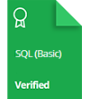

    

## Personal HackerRank Profile

[View Profile](https://www.hackerrank.com/profile/martreb)

## HackerRank Certificates

## HackerRank-SQL-Challenges-Solutions

| Number | Subdomain | Challenge | Difficulty | Solution |
|:------:|:---------:|:---------:|:---------:|:---------:|
| 1 | Basic Select | [Revising the Select Query I](https://www.hackerrank.com/challenges/revising-the-select-query/problem) | Easy | [Solution](https://github.com/MartaReb/HackerRank-SQL-Challenges-Solutions/blob/main/01%20-%20Basic%20Select/01%20-%20Reversing%20the%20Select%20Query%20I.sql)
| 2 | Basic Select | [Revising the Select Query II](https://www.hackerrank.com/challenges/revising-the-select-query-2/problem) | Easy| [Solution](https://github.com/MartaReb/HackerRank-SQL-Challenges-Solutions/blob/main/01%20-%20Basic%20Select/02%20-%20Reversing%20the%20Select%20Query%20II.sql) 
| 3 | Basic Select | [Select All](https://www.hackerrank.com/challenges/select-all-sql/problem) | Easy | [Solution](https://github.com/MartaReb/HackerRank-SQL-Challenges-Solutions/blob/main/01%20-%20Basic%20Select/03%20-%20Select%20All.sql)
| 4 | Basic Select | [Select By ID](https://www.hackerrank.com/challenges/select-by-id/problem) | Easy | [Solution](https://github.com/MartaReb/HackerRank-SQL-Challenges-Solutions/blob/main/01%20-%20Basic%20Select/04%20-%20Select%20By%20ID.sql)
| 5 | Basic Select | [Japanese Cities' Attributes](https://www.hackerrank.com/challenges/japanese-cities-attributes/problem) | Easy | [Solution](https://github.com/MartaReb/HackerRank-SQL-Challenges-Solutions/blob/main/01%20-%20Basic%20Select/05%20-%20Japanese%20Cities'%20Attributes.sql)
| 6 | Basic Select | [Japanese Cities' Names](https://www.hackerrank.com/challenges/japanese-cities-name/problem) | Easy | [Solution](https://github.com/MartaReb/HackerRank-SQL-Challenges-Solutions/blob/main/01%20-%20Basic%20Select/06%20-%20Japanese%20Cities'%20Names.sql)
| 7 | Basic Select | [Weather Observation Station 1](https://www.hackerrank.com/challenges/weather-observation-station-1/problem) | Easy | [Solution](https://github.com/MartaReb/HackerRank-SQL-Challenges-Solutions/blob/main/01%20-%20Basic%20Select/07%20-%20Weather%20Observation%20Station%201.sql)
| 8 | Basic Select | [Weather Observation Station 3](https://www.hackerrank.com/challenges/weather-observation-station-3/problem) | Easy | [Solution](https://github.com/MartaReb/HackerRank-SQL-Challenges-Solutions/blob/main/01%20-%20Basic%20Select/08%20-%20Weather%20Observation%20Station%203.sql)
| 9 | Basic Select | [Weather Observation Station 4](https://www.hackerrank.com/challenges/weather-observation-station-4/problem) | Easy | [Solution](https://github.com/MartaReb/HackerRank-SQL-Challenges-Solutions/blob/main/01%20-%20Basic%20Select/09%20-%20Weather%20Observation%20Station%204.sql)
| 10 | Basic Select | [Weather Observation Station 5](https://www.hackerrank.com/challenges/weather-observation-station-5/problem) | Easy | [Solution](https://github.com/MartaReb/HackerRank-SQL-Challenges-Solutions/blob/main/01%20-%20Basic%20Select/10%20-%20Weather%20Observation%20Station%205.sql)
| 11 | Basic Select | [Weather Observation Station 6](https://www.hackerrank.com/challenges/weather-observation-station-6/problem) | Easy | [Solution](https://github.com/MartaReb/HackerRank-SQL-Challenges-Solutions/blob/main/01%20-%20Basic%20Select/11%20-%20Weather%20Observation%20Station%206.sql)
| 12 | Basic Select | [Weather Observation Station 7](https://www.hackerrank.com/challenges/weather-observation-station-7/problem) | Easy | [Solution](https://github.com/MartaReb/HackerRank-SQL-Challenges-Solutions/blob/main/01%20-%20Basic%20Select/12%20-%20Weather%20Observation%20Station%207.sql)
| 13 | Basic Select | [Weather Observation Station 8](https://www.hackerrank.com/challenges/weather-observation-station-8/problem) | Easy | [Solution](https://github.com/MartaReb/HackerRank-SQL-Challenges-Solutions/blob/main/01%20-%20Basic%20Select/13%20-%20Weather%20Observation%20Station%208.sql)
| 14 | Basic Select | [Weather Observation Station 9](https://www.hackerrank.com/challenges/weather-observation-station-9/problem) | Easy | [Solution](https://github.com/MartaReb/HackerRank-SQL-Challenges-Solutions/blob/main/01%20-%20Basic%20Select/14%20-%20Weather%20Observation%20Station%209.sql)
| 15 | Basic Select | [Weather Observation Station 10](https://www.hackerrank.com/challenges/weather-observation-station-10/problem) | Easy | [Solution](https://github.com/MartaReb/HackerRank-SQL-Challenges-Solutions/blob/main/01%20-%20Basic%20Select/15%20-%20Weather%20Observation%20Station%2010.sql)
| 16 | Basic Select | [Weather Observation Station 11](https://www.hackerrank.com/challenges/weather-observation-station-11/problem) | Easy | [Solution](https://github.com/MartaReb/HackerRank-SQL-Challenges-Solutions/blob/main/01%20-%20Basic%20Select/16%20-%20Weather%20Observation%20Station%2011.sql)
| 17 | Basic Select | [Weather Observation Station 12](https://www.hackerrank.com/challenges/weather-observation-station-12/problem) | Easy | [Solution](https://github.com/MartaReb/HackerRank-SQL-Challenges-Solutions/blob/main/01%20-%20Basic%20Select/17%20-%20Weather%20Observation%20Station%2012.sql)
| 18 | Basic Select | [Higher Than 75 Marks](https://www.hackerrank.com/challenges/more-than-75-marks/problem) | Easy | [Solution](https://github.com/MartaReb/HackerRank-SQL-Challenges-Solutions/blob/main/01%20-%20Basic%20Select/18%20-%20Higher%20Than%2075%20Marks.sql)
| 19 | Basic Select | [Employee Names](https://www.hackerrank.com/challenges/name-of-employees/problem) | Easy | [Solution](https://github.com/MartaReb/HackerRank-SQL-Challenges-Solutions/blob/main/01%20-%20Basic%20Select/19%20-%20Employee%20Names.sql)
| 20 | Basic Select | [Employee Salaries](https://www.hackerrank.com/challenges/salary-of-employees/problem) | Easy | [Solution](https://github.com/MartaReb/HackerRank-SQL-Challenges-Solutions/blob/main/01%20-%20Basic%20Select/20%20-%20Employee%20Salaries.sql)
| 21 | Advanced Select | [Type of Triangle](https://www.hackerrank.com/challenges/what-type-of-triangle/problem) | Easy | [Solution](https://github.com/MartaReb/HackerRank-SQL-Challenges-Solutions/blob/main/02%20-%20Advanced%20Select/01%20-%20Type%20of%20Triangle.sql)
| 22 | Advanced Select | [The PADS](https://www.hackerrank.com/challenges/the-pads/problem) | Medium | [Solution](https://github.com/MartaReb/HackerRank-SQL-Challenges-Solutions/blob/main/02%20-%20Advanced%20Select/02%20-%20The%20PADS.sql)
| 22 | Advanced Select | [Occupations](https://www.hackerrank.com/challenges/occupations/problem) | Medium | [Solution](https://github.com/MartaReb/HackerRank-SQL-Challenges-Solutions/blob/main/02%20-%20Advanced%20Select/03%20-%20Occupations.sql)
| 23 | Advanced Select | [Binary Tree Nodes](https://www.hackerrank.com/challenges/binary-search-tree-1/problem) | Medium | [Solution](https://github.com/MartaReb/HackerRank-SQL-Challenges-Solutions/blob/main/02%20-%20Advanced%20Select/04%20-%20Binary%20Tree%20Nodes.sql)
| 24 | Advanced Select | [New Companies](https://www.hackerrank.com/challenges/the-company/problem) | Medium | [Solution]
| 25 | Aggregation | [Revising Aggregations - The Count Function](https://www.hackerrank.com/challenges/revising-aggregations-the-count-function/problem) | Easy | [Solution](https://github.com/MartaReb/HackerRank-SQL-Challenges-Solutions/blob/main/03%20-%20Aggregation/01%20-%20Revising%20Aggregations%20-%20The%20Count%20Function.sql)
| 26 | Aggregation | [Revising Aggregations - The Sum Function](https://www.hackerrank.com/challenges/revising-aggregations-sum/problem) | Easy | [Solution](https://github.com/MartaReb/HackerRank-SQL-Challenges-Solutions/blob/main/03%20-%20Aggregation/02%20-%20Revising%20Aggregations%20-%20The%20Sum%20Function.sql)
| 27 | Aggregation | [Revising Aggregations - Averages](https://www.hackerrank.com/challenges/revising-aggregations-the-average-function/problem) | Easy | [Solution](https://github.com/MartaReb/HackerRank-SQL-Challenges-Solutions/blob/main/03%20-%20Aggregation/03%20-%20Revising%20Aggregations%20-%20Averages.sql)
| 28 | Aggregation | [Average Population](https://www.hackerrank.com/challenges/average-population/problem) | Easy | [Solution](https://github.com/MartaReb/HackerRank-SQL-Challenges-Solutions/blob/main/03%20-%20Aggregation/04%20-%20Average%20Population.sql)
| 29 | Aggregation | [Japan Population](https://www.hackerrank.com/challenges/japan-population/problem) | Easy | [Solution](https://github.com/MartaReb/HackerRank-SQL-Challenges-Solutions/blob/main/03%20-%20Aggregation/05%20-%20Japan%20Population.sql)
| 30 | Aggregation | [Population Density Difference](https://www.hackerrank.com/challenges/population-density-difference/problem) | Easy | [Solution](https://github.com/MartaReb/HackerRank-SQL-Challenges-Solutions/blob/main/03%20-%20Aggregation/06%20-%20Population%20Density%20Difference.sql)
| 31 | Aggregation | [The Blunder](https://www.hackerrank.com/challenges/the-blunder/problem) | Easy | [Solution](https://github.com/MartaReb/HackerRank-SQL-Challenges-Solutions/blob/main/03%20-%20Aggregation/07%20-%20The%20Blunder.sql)
